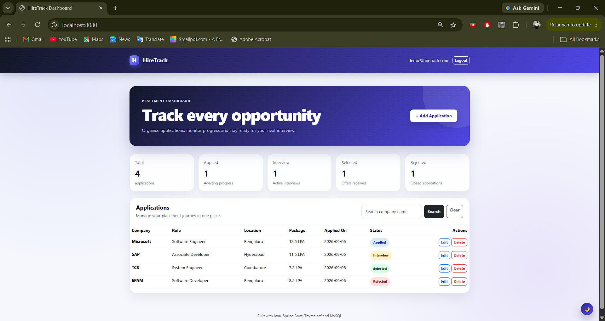
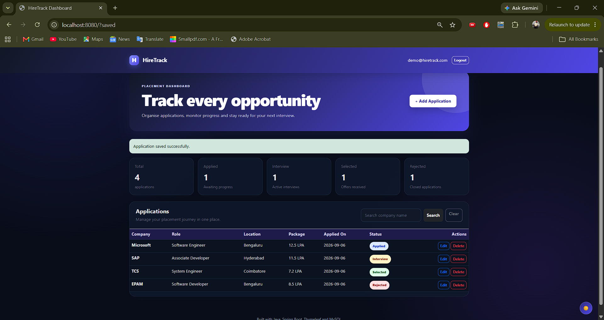
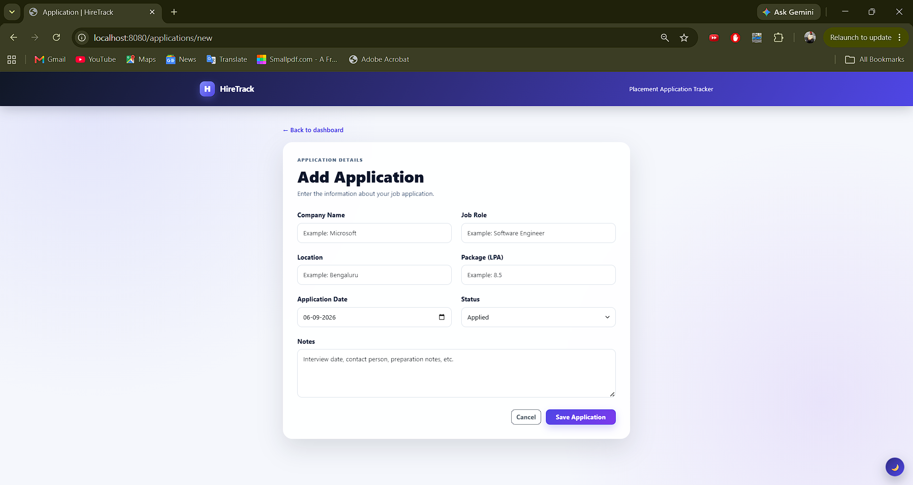
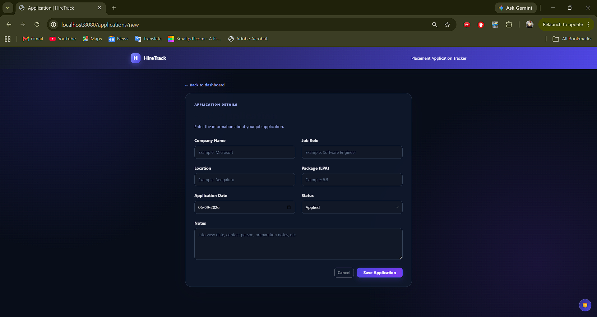
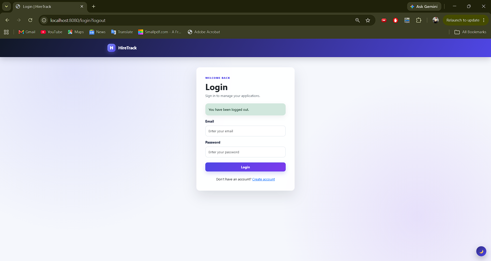
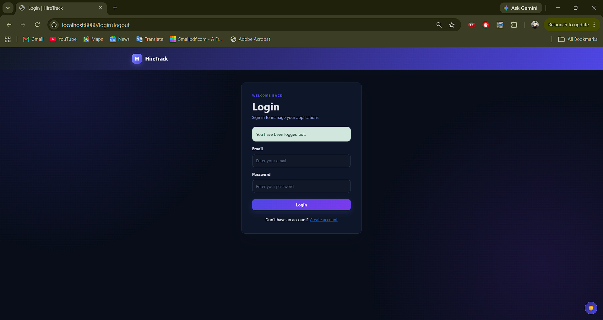
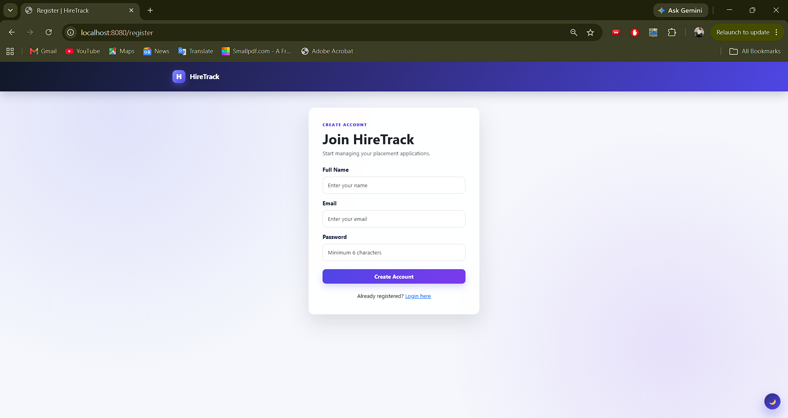
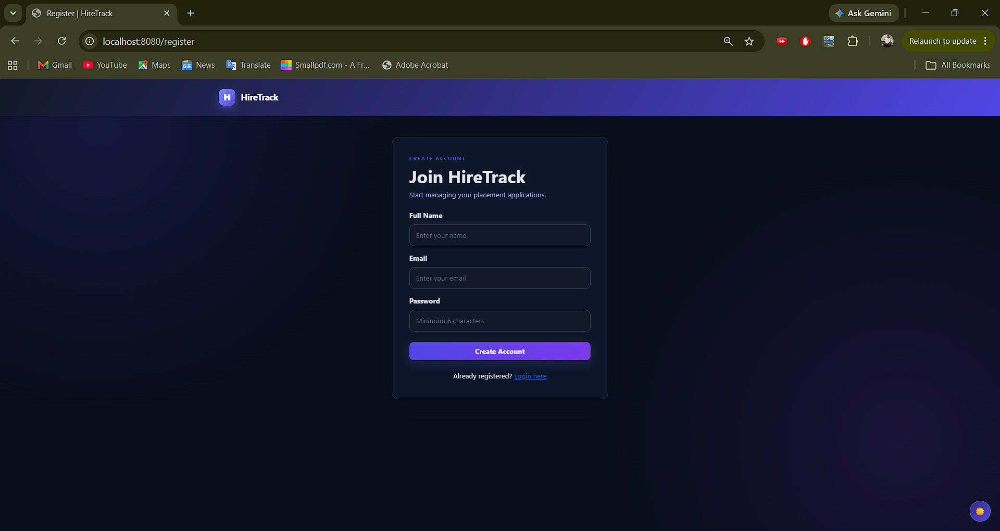
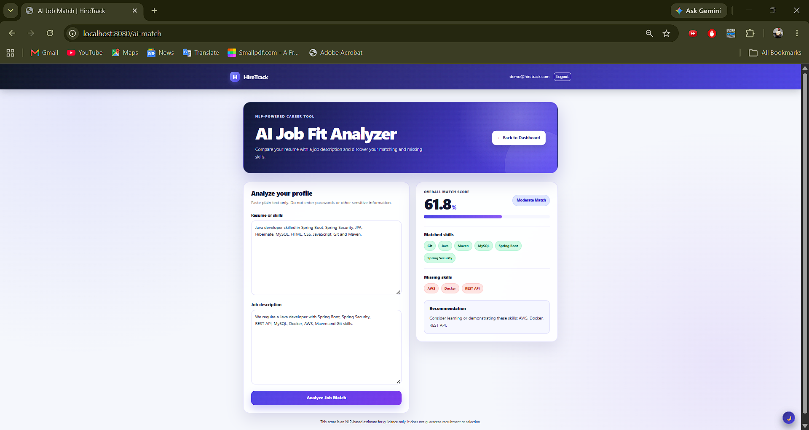
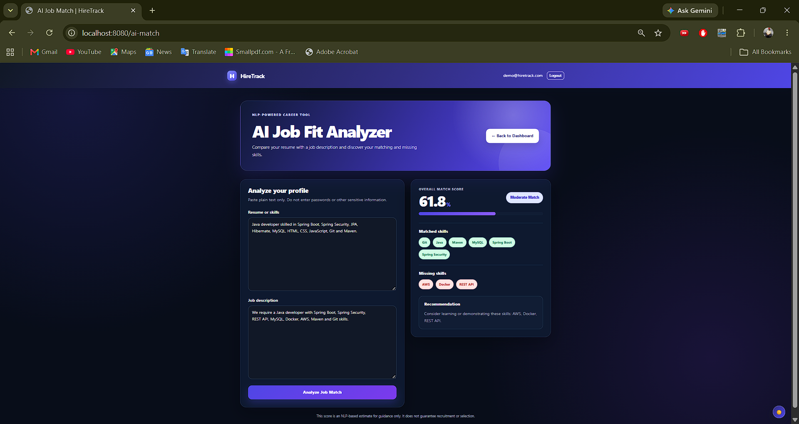

# HireTrack – AI-Assisted Placement Tracker

A secure full-stack placement application tracker featuring an NLP-powered
Job Fit Analyzer that compares resumes with job descriptions, calculates a
match score, and identifies matched and missing skills.

## 🤖 AI Job Fit Analyzer

- Extracts technical skills from resumes and job descriptions
- Identifies matched and missing skills
- Calculates skill-coverage and text-similarity scores
- Uses TF-IDF and cosine similarity for textual comparison
- Generates personalised skill-improvement recommendations
- Works without sending resume data to an external AI service

## Features

- Secure user registration and login
- BCrypt password encryption
- User-specific application data
- Add, view, edit and delete applications
- Search applications by company name
- Track Applied, Interview, Selected and Rejected counts
- Form validation with helpful error messages
- Responsive dashboard
- Persistent light and dark themes
- MySQL database persistence
- Layered MVC architecture
- NLP-based job-fit analysis using TF-IDF, cosine similarity and technical-skill extraction
- Displays resume–job match score, matched skills, missing skills and recommendations

## Technology Stack

- Java 21
- Spring Boot 4
- Spring MVC
- Spring Security
- Spring Data JPA
- Hibernate
- Thymeleaf
- MySQL
- Maven
- Bootstrap 5
- HTML, CSS and JavaScript

## Architecture

The project follows a layered architecture:

- **Controller layer:** Handles HTTP requests and page navigation
- **Service layer:** Contains application and security logic
- **Repository layer:** Communicates with MySQL using Spring Data JPA
- **Model layer:** Defines users and job application entities
- **View layer:** Thymeleaf templates with Bootstrap and custom CSS

## Main Functionalities

Each registered user can:

1. Log in securely
2. Add a job application
3. View personal application statistics
4. Search applications by company
5. Edit application information and status
6. Delete applications
7. Switch between light and dark mode
8. Log out securely

Applications belonging to one user are not accessible to another user.

## Database Setup

Create the MySQL database:

```sql
CREATE DATABASE IF NOT EXISTS hiretrack_db;
```

The application reads the MySQL password from the environment variable:

```text
HIRETRACK_DB_PASSWORD
```

No database password is stored in the source code.

## Running the Project on Windows

Set the database password securely in PowerShell:

```powershell
$securePassword = Read-Host "Enter MySQL password" -AsSecureString
$env:HIRETRACK_DB_PASSWORD = [System.Net.NetworkCredential]::new("", $securePassword).Password
```

Start the application:

```powershell
.\mvnw.cmd spring-boot:run
```

Open:

```text
http://localhost:8080
```

## Build Verification

Run:

```powershell
.\mvnw.cmd clean package
```

A successful build creates the executable JAR inside the `target` directory.

## Project Structure

```text
src/main/java/com/tejas/hiretrack
├── config
├── controller
├── model
├── repository
└── service

src/main/resources
├── static
│   ├── css
│   └── js
├── templates
└── application.properties
```
## Screenshots

### Dashboard

| Light Theme | Dark Theme |
|---|---|
|  |  |

### Application Form

| Light Theme | Dark Theme |
|---|---|
|  |  |

### Login Page

| Light Theme | Dark Theme |
|---|---|
|  |  |

### Registration Page

| Light Theme | Dark Theme |
|---|---|
|  |  |

### AI Job Fit Analyzer

| Light Theme | Dark Theme |
|---|---|
|  |  |

## Security

- Passwords are hashed using BCrypt
- Protected pages require authentication
- CSRF protection remains enabled
- Job applications are filtered by the authenticated user
- Database credentials are supplied through an environment variable

## Author

**Tejas Singh**

B.Tech Computer Science — Artificial Intelligence and Machine Learning